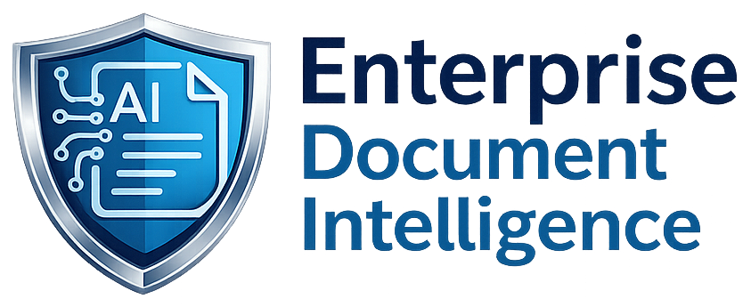
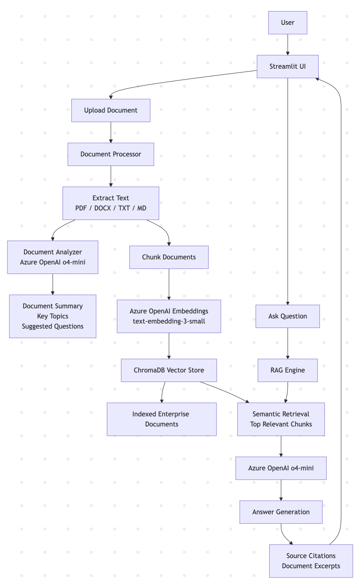

# Enterprise AI Compliance Copilot

  

**Live Demo:** https://enterprise-ai-compliance-copilot.onrender.com

AI-powered document intelligence platform that enables users to upload enterprise documents, ask natural language questions, and receive source-grounded answers using Retrieval-Augmented Generation (RAG).

## Overview

Organizations maintain large collections of policies, procedures, manuals, contracts, regulatory guidance, and compliance documentation.

Finding accurate information quickly is often difficult and time-consuming.

Enterprise AI Compliance Copilot uses Azure OpenAI and semantic retrieval to transform enterprise documents into an intelligent, searchable knowledge base.

## Features

### Document Intelligence

- PDF Upload
- DOCX Upload
- TXT Upload
- Markdown Upload
- Automatic Document Analysis
- AI-Generated Summaries
- Key Topic Extraction
- Suggested Questions

### Retrieval-Augmented Generation (RAG)

- Semantic Search
- Vector Embeddings
- Context-Aware Retrieval
- Source-Grounded Answers
- Citation Support

### AI Capabilities

- Azure OpenAI o4-mini
- Azure OpenAI text-embedding-3-small
- Natural Language Question Answering
- Document Understanding

### User Experience

- Streamlit Web Interface
- FastAPI Backend
- Interactive Document Upload
- Question & Answer Interface

## Example Questions

- Can employees store customer SIN numbers in any system?
- What is the password policy?
- What are the document retention requirements?
- What are the admission requirements?
- How much does the program cost?
- What are the graduation requirements?

## Technology Stack

### Backend

- Python
- FastAPI

### AI

- Azure OpenAI
- LangChain
- ChromaDB

### Frontend

- Streamlit

### Deployment

- Render

## Architecture

The system combines document ingestion, semantic retrieval, Azure OpenAI and source-grounded question answering.

---
## Live Demo

https://enterprise-ai-compliance-copilot.onrender.com

## Project Highlights

* Enterprise AI Architecture
* Retrieval-Augmented Generation (RAG)
* Azure OpenAI Integration
* Document Intelligence
* Semantic Search
* Source Citations
* Cloud Deployment
* Production-Oriented AI Engineering

## Future Enhancements

* LangGraph Multi-Agent Workflows
* PostgreSQL + pgvector
* Risk Classification
* Audit Logging
* Enterprise Authentication
* Regulatory Change Monitoring
* React Frontend

## Status

Active development and enhancement.

## Developer
* Alem Mekru 
* MSc. in Artificial Intelligence
